Vue2源码揭秘 - 虚拟DOM和diff算法

# 1、介绍

## 1.1 虚拟DOM

    虚拟 DOM (Virtual DOM，简称 VDOM) 是一种编程概念，意为将目标所需的 UI 通过数据结构“虚拟”地表示出来，保存在内存中，然后将真实的DOM与之保持同步。具体来说，虚拟 DOM 是由一系列的 JavaScript 对象组成的树状结构，每个对象代表着一个DOM元素，包括元素的标签名、属性、子节点等信息。虚拟 DOM 中的每个节点都是一个 JavaScript 对象，它们可以轻松地被创建、更新和销毁，而不涉及到实际的DOM操作。

如下这种DOM结构

```html
<div>
    <div id="apple">苹果</div>
    <div class="banana">香蕉</div>
    <div>火龙果</div>
</div>
```

Vue是基于 vdom 的前端框架，组件渲染会返回 vdom，渲染器再把 vdom 通过增删改的 api 同步到 dom。

这种结构在vue中会被解析成类似下面这种结构（省略部分属性）

```js
{
  tag:'div',
  data:undefined,
  children:[
    {
      tag:'div',
      data:{
        attrs:{
          id:"apple"
        }
      },
      children:[
        {
          tag:undefined,
          text:"苹果"
        }
      ]
    },
    {
      tag:'div',
      data:{
        staticClass:'bannana'
      },
      children:[
        {
          tag:undefined,
          text:"香蕉"
        }
      ]
    },
    {
      tag:'div',
      data:undefined,
      children:[
        {
          tag:undefined,
          text:"火龙果"
        }
      ]
    }
  ]
}
``` 

## 1.2 diff算法

### 1.2.1 前世今生

    前世：diff算法最初是计算机科学家迈克尔·菲舍尔和丹尼尔·希尔伯特发明的一种文本比较算法。

    今生：随着前端开发的兴起，diff算法被引入到虚拟DOM中，成为一种高效更新用户界面的核心技术。其目的是高效地识别出从一个状态到另一个状态所需的最小变更集。因为在浏览器中操作DOM性能消耗比较昂贵，比如节点的添加、删除等，所以diff算法可以尽可能的减少DOM的操作量，避免频繁的DOM操作带来的性能开销，进而减少浏览器的性能负担。 

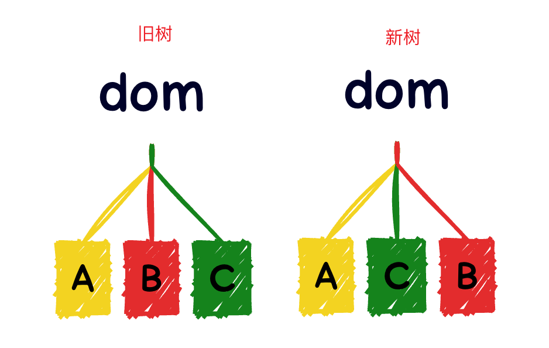
 
如上：如果需要将上图中左边的DOM树更新为右边的DOM树，在不采用虚拟DOM的情况下（即无法复用DOM节点），可能需要进行6次DOM操作：

1. 卸载所有旧子节点，需要 3 次 DOM 删除操作。
2. 挂载所有新子节点，需要 3 次 DOM 添加操作。
 
但是如果采用diff算法复用DOM节点的策略进行的话，实际上只需要进行1次DOM操作：

 1. 移动新的一组子节点的B节点到C节点的后面

### 1.2.2 diff算法的复杂度

两棵树做 diff，复杂度是 O(n^3) 。因为每个节点都要去和另一棵树的全部节点对比一次，这就是 n 了，如果找到有变化的节点，执行插入、删除、修改也是 n 的复杂度。所有的节点都是这样，再乘以 n，所以是 O(n * n * n) 的复杂度。

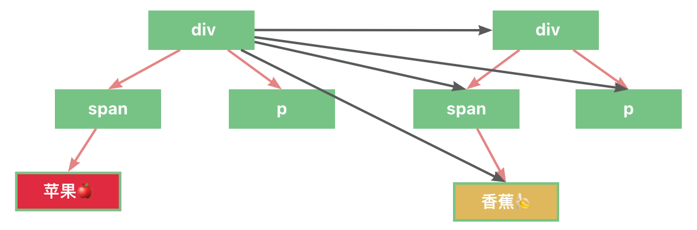

这样的复杂度对于前端框架来说是不可接受的，这意味着 1000 个节点，渲染一次就要处理 1000 * 1000 * 1000，一共 10 亿次。

所以前端框架的 diff 约定了两种处理原则：```只做同层的对比，type 变了就不再对比子节点```。

因为 dom 节点做跨层级移动的情况还是比较少的，一般情况下都是同一层级的 dom 的增删改。

这样只要遍历一遍，对比一下 type 就行了，是 O(n) 的复杂度，而且 type 变了就不再对比子节点，能省下一大片节点的遍历。另外，因为 vdom 中记录了关联的 dom 节点，执行 dom 的增删改也不需要遍历，是 O(1)的，整体的 diff 算法复杂度就是 O(n) 的复杂度。 

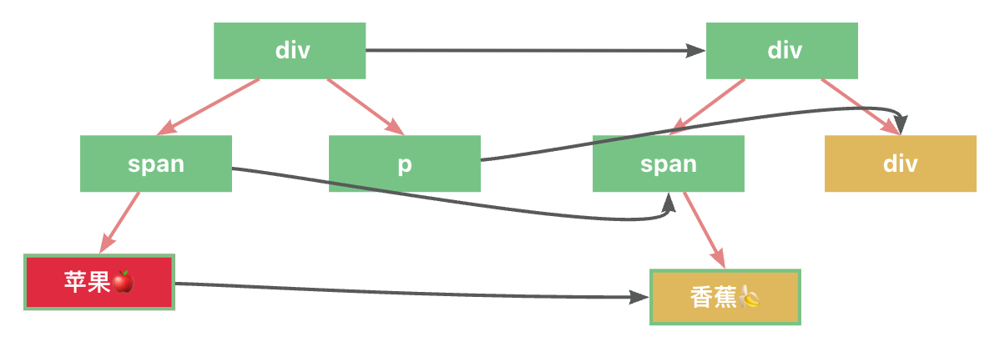

### 1.2.3 diff算法的核心原理

#### 1.2.3.1 同层比较

    算法会在两个虚拟DOM树的同一层级上进行对比，而不会跨层级对比。这意味着它首先检查每个父节点下的子节点是否相同，然后递归进入子树进行比较。

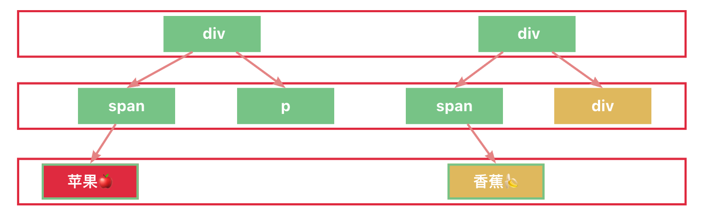
 
由之前的章节可知：双端diff算法设计成只有同层节点进行比较的原因有以下2点：

1. 降低diff算法的复杂度
2. dom 节点做跨层级移动的情况还是比较少的，一般情况下都是同一层级的 dom 的增删改

#### 1.2.3.2 相同节点判断策略

如下图，在Vue中，判断是否是相同节点的逻辑是 ```节点的标签（p节点）```以及 ```节点的key（key=1）``` 相同是即视为同一个节点，这么做是因为type 变了就不再对比子节点，可以省下一大片节点的遍历，提升性能。

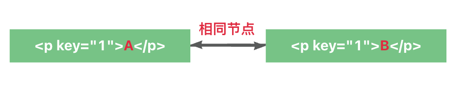

#### 1.2.3.3 循环从两边向中间比较

这是一种优化策略，算法不是线性遍历每一个节点，而是从两端开始，向中间逐步靠拢，这样可以在某些情况下更早地发现差异并终止不必要的比较。

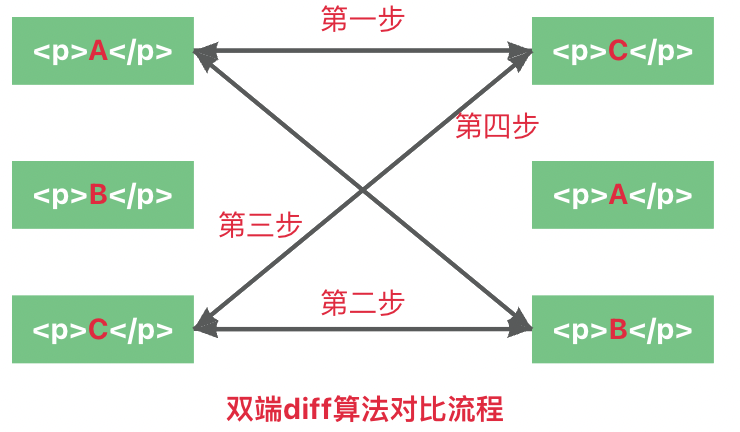

1. 第一步：比较旧的一组子节点中的第一个子节点 p-C 与新的一组子节点中的第一个子节点 p-A。 
2. 第二步：比较旧的一组子节点中的最后一个子节点 p-B 与新的一组子节点中的最后一个子节点 p-C。
3. 第三步：比较旧的一组子节点中的第一个子节点 p-A 与新的一组子节点中的最后一个子节点 p-C。
4. 第四部：比较旧的一组子节点中的最后一个子节点 p-B 与新的一组子节点中的第一个子节点 p-A。


#### 1.2.3.4 节点复用

在diff算法中，节点复用是一个非常重要的优化手段。通过复用旧节点，可以大大减少DOM操作，从而提升渲染效率。

Vue.js团队通过引入key的概念，实现了节点复用的功能。key是一个唯一的标识符，它可以帮助Vue.js区分不同的节点。当新旧节点的key相同时，Vue.js就会复用旧节点，而不是创建新节点。

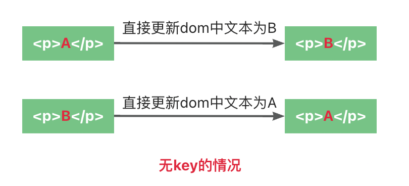

* 在没有key的情况下，判断上面属于同一个节点，直接进行子节点的对比，子节点是文字，则直接更新文字。

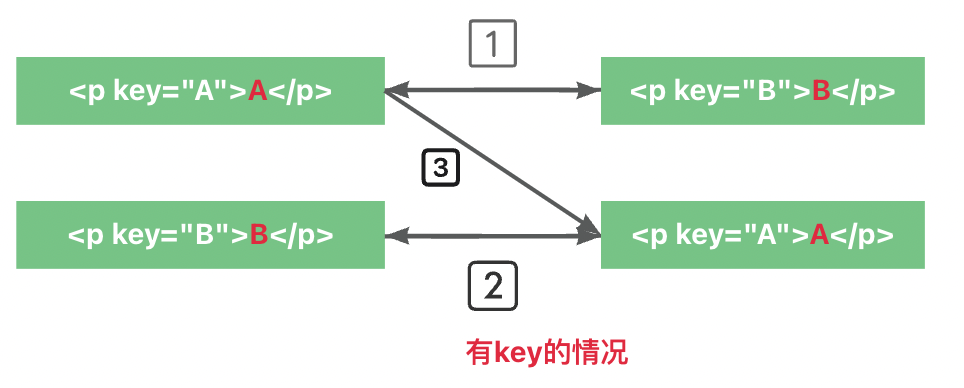

1. 第一步，在有key的情况下，判断不属于同个节点，跳过
2. 第二步，在有key的情况下，判断不属于同个节点，跳过
3. 第三步，在有key的情况下，判断属于同个节点，进行节点复用操作（具体操作后续会说） 

## 1.3 虚拟DOM和diff的关联

虚拟DOM是一种可以表示DOM的抽象层面的树形结构，它可以高效地更新到实际的DOM上。在Vue中，每个组件都有一个对应的渲染函数，这个函数返回一个描述该组件视图的虚拟节点树。当组件的状态发生变化时，新的渲染函数会被调用，产生一个新的虚拟节点树。Vue的diff算法就是用来比较新旧虚拟节点树的差异，找出最小的DOM操作来更新实际的DOM。   

下面是一个简化的例子：

```js
// 假设有一个简单的组件
let component = {
  data: 'Hello, Vue!',
  template: `<div>{{ data }}</div>`
};
 
// 首次渲染，生成虚拟DOM
let oldVnode = Vue.render(component);
 
// 假设数据更新，产生新的虚拟DOM
let newVnode = Vue.render(component);
 
// Vue的diff算法比较新旧虚拟DOM
let patches = Vue.diff(oldVnode, newVnode);
 
// 根据diff结果应用到实际DOM
Vue.patch(document.body, patches);
```

在这个例子中，Vue首次渲染组件时生成了一个虚拟DOM节点（oldVnode）。当组件的数据更新时，Vue再次渲染组件，生成了一个新的虚拟DOM节点（newVnode）。Vue的diff算法会比较这两个虚拟节点，找出需要执行的最小DOM操作（patches），最后这些DOM操作会被应用到实际的DOM上，以此来更新视图。


## 1.4 snabbdom简介

Snabbdom是瑞典语单词，原意为”速度“。是一个轻量级的虚拟DOM和DOM diff算法库，它被设计用于以非常高效的方式更新真实DOM。Vue.js在2.x版本中采用了虚拟DOM的概念来提高其性能和效率，而Vue 2.x内部使用的虚拟DOM实现实际上是在Snabbdom的基础上进行了一些定制和改造的。

Vue团队选择Snabbdom作为其虚拟DOM实现的原因主要是因为Snabbdom的高性能特性和小巧的体积。它提供了一个简洁的API来创建和管理虚拟节点（vnodes），并通过高效的diff算法来计算出虚拟DOM树的最小变更集，进而只对实际DOM进行必要的更新，减少了不必要的DOM操作，提高了页面的渲染效率。

vue2源码中更新基本和snabbdom中一致，部分边角细节不一致，所以我们看一下snabbdom源码大致就可以了解Vue更新的细节。

github地址：[https://github.com/snabbdom/snabbdom](https://github.com/snabbdom/snabbdom)

```js
import {
  init,
  h
} from "snabbdom";

const patch = init([]);

const container = document.getElementById("container");

const myVnode = h('div',[
    h('p','苹果'),
    h('p','香蕉'),
    h('p','火龙果'),
]);

const myVnode2 = h('div',[
    h('p','苹果'),
    h('p','香蕉'),
    h('p','桃子'),
])


patch(container, myVnode);

document.getElementById('btn').addEventListener('click',()=>{
  //疑问 为啥每次点会新增E 
  patch(myVnode, myVnode2);
})
```

    界面上渲染效果如下所示：
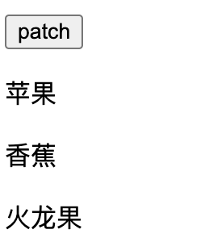

    点击按钮后：
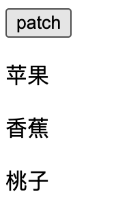

由之前的diff算法可知，当点击更新以后，界面上会复用前两个元素苹果和香蕉(即没有销毁以及重新创建)，那么如何证明它复用了呢，其实很简单，只需要在浏览器中手动更改前2个元素，如果点击更新以后，更改的前2个元素没有变化，即可证明它并对dom节点进行了复用。

如上代码所示，patch即为vue中的第一次渲染，点击按钮更新新的vnode相当于vue中的更新渲染，只不过vue中将行为进行了一些封装。所以掌握snabbdom即可掌握vue2的核心双端diff算法。


# 2、生成虚拟DOM的方法h

我们这里不讨论DOM如何变成虚拟DOM 这属于模板编译原理范畴 但是虚拟节点变成DOM节点我们这篇会说到。

## 2.1 Vue的runtime-only模式

在Vue中，通常我们会采取Runtime-Only模式运行Vue项目，在这个模式中，我们在构建阶段所有的模版```(<template>标签中的HTML)```已经被预编译成Javascript渲染函数（render函数），预编译过程通常由如vue-loader配合vue-template-compiler这样的工具在Webpack构建过程中完成，它们会把.vue文件中的模板转换为高效的JavaScript代码。

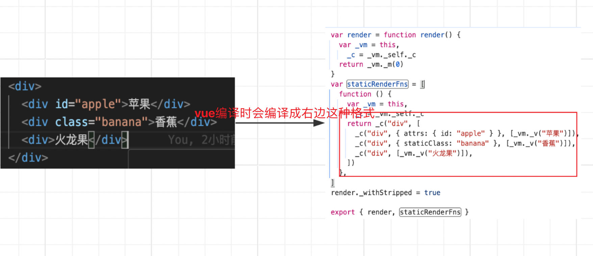

    这里为什么不是render而是staticRenderFns呢？staticRenderFns 是 Vue 中的一个概念，与 Vue 的渲染机制相关。在 Vue 的模板编译过程中，对于某些静态的、不依赖于数据变化的 DOM 结构，Vue 会将其提取出来，生成对应的渲染函数并放在 staticRenderFns 数组里。这样做是为了优化渲染性能，因为静态内容在初次渲染后不需要随着数据变化而更新，可以避免不必要的重新渲染。

## 2.2 vnode.js

在snabbdom中，vnode.js模块主要用于创建vnode。下面的函数主要有三个功能：```1.创建Vnode 2.描述虚拟DOM结构 3.diff算法的基础```

```js
//src/vnode.js
export function vnode(
    sel,
    data,
    children,
    text,
    elm
){
    const key = data === undefined ? undefined : data.key;
    return { sel, data, children, text, elm, key };
}
```

    由上面的代码可以看出虚拟节点vnode的属性有哪些：

```js
{
    children: undefined,// 子节点
    data: {},// 属性、样式、key
    elm: undefined, // 对应的真正的dom节点(对象)，undefined表示节点还没有上dom树
    key:undefined, // vnode唯一标识
    sel:"div", // 选择器
    text: "hello" // 文本内容
}
```


## 2.3 h函数

上节我们知道，在vue中是通过模版编译将html编译成为一个render函数，其实这个render函数运行的返回值就是虚拟DOM。我们可以看到vue中采用的是vm._c来实现生成虚拟DOM，而在snabbdom中是使用h函数来生成虚拟DOM的。


### 2.3.1 h函数使用

比如这样调用h函数：
```js
h('a', 
    {
        props:{
            href:'http://www.baidu.com'
        }
    }, 
    "百度一下"
);
```
将得到这样的虚拟节点：
```js
{
    "sel": "a",
    "data": {
        "props": {
            "href": "http://www.baidu.com"
        }
    },
    "text": "百度一下"
}
```
它表示真正的DOM节点
```html
<a href="http://www.baidu.com">百度一下</a>
```

### 2.3.2 h函数源码

```js
export function h(sel, b, c){
    // 存放属性
    let data = {};
    // 存放子节点
    let children ;
    let text;
    let i;

    if(c !== undefined){
        if(b !== null){
            data = b;
        }
        if(is.array(c)){
            children = c;
        } else if(is.primitive(c)){
            text = c.toString();
        } else if( c && c.sel){
            children = [c];
        }
    }else if(b !== undefined && b !== null){
        if(is.array(b)){
            children = b;
        }else if(is.primitive(b)){
            text = b.toString();
        }else if(b && b.sel){
            children = [b];
        }else {
            data = b;
        }
    }

    if(children !== undefined){
        for(i = 0;i < children.length; ++i){
            if(is.primitive(children[i])){
                children[i] = vnode( 
                        undefined,
                        undefined,
                        undefined,
                        children[i],
                        undefined
                ) 
            }
        }
    }
    return vnode(sel,data,children,text,undefined);
}
```

h函数其实也没有什么好讲的，可以看到这个函数最后返回了一个vnode方法的返回值，可以知道h函数就是调用vnode对传入的属性进行整合，最后返回vnode，至于其中的一大堆逻辑，其实就是对第二个参数和第三个参数进行数据的兼容，比如：

```js
h('div',undefined,['hello']) 
===
h('div',['hello'])
```

上面这2个vnode是完全相等的。这里hello是要放到子节点里面的，即vnode的children属性中，但是我们这里将hello放进了第二个参数，所以函数需要判断用户真实的意图，这里的逻辑是判断第二个参数如果是数组即将其变成children属性，

这里需要注意的是这个函数最后会循环遍历children，如果children中存在原始类型如文本，他会将其转化为一个文本vnode。

# 3、首次挂载

    初始化渲染时，不用进行diff判断，直接将整个虚拟DOM挂载到容器上。

## 3.1 前置知识-DOM相关操作

### 3.1.1 isElement

该函数判断传入的参数node是否是一个元素节点。在DOM（文档对象模型）中，节点类型由nodeType属性来表示，其中nodeType的值为1表示元素节点（Element Node）。如```div```、```span``` 等。

```js
function isElement(node){
    return node.nodeType === 1;
}
```

### 3.1.2 createElement

该函数封装了原生document.createElement方法，创建并返回元素。它接受两个参数：tagName和options。

1. tagName: 字符串类型，指定了要创建的元素类型，比如div、span、img
2. options: 可选对象，这是一个在某些现代浏览器和 JavaScript 环境中支持的参数，用于指定新创建元素的属性和其他配置。例如，你可以用它来设置元素的 is 属性（定义自定义元素）或者指定元素的 namespaceURI（命名空间）。这个参数是 HTML5 和后来的规范引入的，不是所有环境都支持。

```js
function createElement(
    tagName,
    options
){
    return document.createElement(tagName,options);
}
```

### 3.1.3 createTextNode

该函数的作用是创建一个新的文本节点（text node）,其中包含指定的文本内容。

```js
function createTextNode(text){
    return document.createTextNode(text);
} 
```

### 3.1.4 appendChild

该函数的作用是将一个子节点添加到指定的父节点中。函数的执行过程就是把child这个子元素添加到node这个父元素的子元素列表的末尾。

```js
function appendChild(node, child){
    node.appendChild(child);
}
```

### 3.1.5 tagName

该函数的作用是获取传入元素（element）的标签名（tag name）需要注意的是这里的返回值是大写，如果使用需要搭配toLowerCase()

```js
function tagName(elm){
  return elm.tagName;
}
```

### 3.1.6 parentNode

该函数的作用是获取传入元素的父节点。

```js
function parentNode(node){
    return node.parentNode;
}
```

### 3.1.7 insertBefore

该函数的作用是在指定的参考节点前面插入一个新的节点。

```js
function insertBefore(
    parentNode,
    newNode,
    referenceNode
){
    parentNode.insertBefore(newNode, referenceNode);
}
```

### 3.1.8 nextSibling

该函数的作用是返回传入的元素elm的下一个兄弟节点

```js
function nextSibling(elm){
    return elm.nextSibling;
}
```

## 3.2 第一步判断是不是真实节点

首先判断旧节点是不是真实DOM节点，如果是真实DOM节点将其通过emptyNodeAt转化为一个虚拟节点。

```js
// 一个将dom节点转化为虚拟节点的函数
function emptyNodeAt(elm){
        const id = elm.id ? "#" + elm.id : "";
        return vnode(
            api.tagName(elm).toLowerCase() + id,
            {},
            [],
            undefined,
            elm
        );
}
function patch(
    oldVnode,
    newVnode
){
    // 首先判断oldVnode是不是虚拟节点（这里的api就是dom一些方法的集合）
    if(isElement(api,oldVnode)){
        // 传入的第一个参数是DOM节点 ，此时要包装为虚拟节点
        oldVnode = emptyNodeAt(oldVnode);
    }
}
```

## 3.3 第二步判断oldVnode和newVnode是不是同一个虚拟节点

在初始化时，第一次我们执行patch时oldVnode实际上是“挂载的容器”，然后会执行emptyNodeAt将oldVnode转化为一个虚拟节点。

```js
// 判断是否是同一个虚拟节点
if(sameVnode(oldVnode, vnode)){
    console.log("是同一个节点，进行精细化比较")         
}else{
    console.log("不是同一个节点，暴力插入新的，删除旧的");
    // 获取旧虚拟节点的真实节点
    elm = oldVnode.elm;
    // 因为我们这里暴力插入新的节点，删除旧的节点，这里旧的节点实际上指的就是这个容器，而插入节点需要调用insertBefore，所以需要获取旧节点的父元素 方便后续调用
    parent = api.parentNode(elm);
    // 在虚拟节点上创建真实节点的方法
    createElm(vnode);

    if(parent !== null){
        api.insertBefore(parent, vnode.elm, api.nextSibling(elm));
        }
    }
```

### 3.3.1 sameVnode

在源码中，是这么定义同一个节点的：
1. 旧节点的key要和新节点的key相同
2. 旧节点的选择器要和新节点的选择器相同（实际上不止这些判断 但是核心就是使用这2个属性进行判断）

```js
function sameVnode(vnode1, vnode2){
    const isSameKey = vnode1.key === vnode2.key;
    const isSameSel = vnode1.sel === vnode2.sel;

    return isSameKey && isSameSel;
}
```

    当判断为同一个节点之后，就要进行精细化比较了。这部分内容比较复杂，我们放到后面再说。

### 3.3.2 createElm

```js
function createElm(vnode){
        let  sel = vnode.sel;
        const data = vnode.data;
        const elm = api.createElement(sel, data);
        const children = vnode.children;

        // 非文本节点
        if(sel !== undefined){
            vnode.elm = elm;
            // 如果节点是文本节点 （没有子节点）=> h('div','文本')
            if(is.primitive(vnode.text) && (!is.array(children) || children.length === 0)){
                api.appendChild(elm, api.createTextNode(vnode.text));
            }
            if(is.array(children)){
                for(let i = 0;i < children.length; ++i ){
                    const ch = children[i];
                    if(ch != null){
                        api.appendChild(elm, createElm(ch));
                    }
                }
            } 
        }else{
            // 文本节点
            vnode.elm = api.createTextNode(vnode.text);
        }
        
        return vnode.elm;
}
```
1. ```初始化变量```:从vnode对象中获取选择器（sel）、数据属性（data）、子节点（children）以及文本内容（text）。
2. ```创建DOM元素```:当sel存在，即非文本节点时，使用api.createElement()方法根据选择器和数据属性创建一个DOM元素，并将其赋值给elm。 
3. ```处理文本内容```: 检查vnode.text是否为原始类型（如字符串），并且无子节点或子节点数组为空，此时将文本通过api.createTextNode()转换为文本节点，并追加到刚创建的元素中。
4. ```递归处理子节点```:如果children是一个数组，函数会遍历每个子节点，对每个子节点递归调用createElm()函数以生成其对应的DOM结构，然后将这些子DOM元素追加到父元素中，实现嵌套结构的构建。
5. ```处理纯文本节点```:如果sel未定义，表明这是一个纯文本节点，直接使用api.createTextNode()创建文本节点，并将其赋值给vnode.elm。

## 3.4 流程图

### 3.4.1 初次渲染流程图

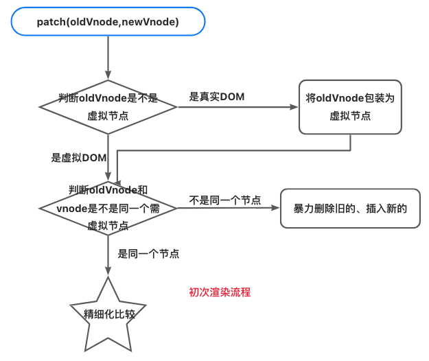

### 3.4.2 createElm流程图

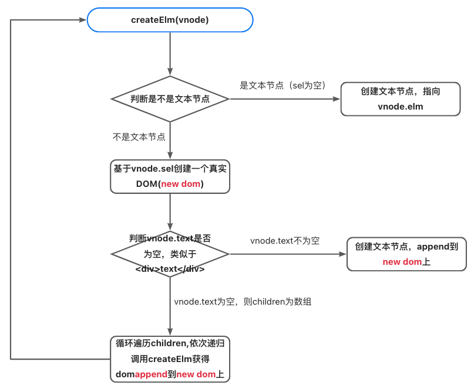


# 4、更新渲染patchVnode 打补丁逻辑

上节中，我们学到了如何实现首次渲染，即将vnode直接挂载到容器上。当执行patch函数更新新旧节点时，之前我们只说明了当新旧节点是不同的情况下，暴力重新渲染新的节点。

这节会补充相同节点进行更新渲染的相关逻辑。

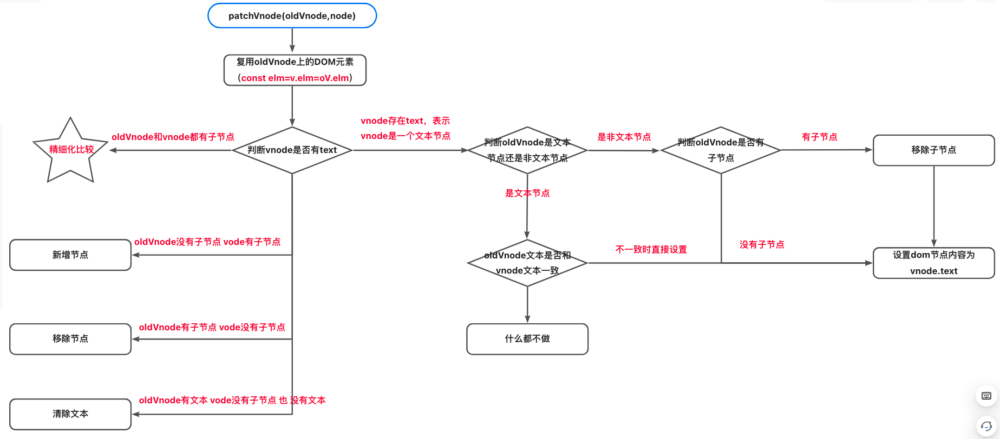

## 4.1 为什么更新函数名叫patchVnode

```js
const patch = init();

//首次渲染
patch(document.getElementId('container'),vNode);
//第二次渲染
patch(vNode,newVnode)
```

如上面的代码所示，由于首次渲染时已经把vNode渲染到container内了，所以再次调用patch函数并尝试渲染newVnode时，就不能简单的执行挂在动作了。在这种情况下，渲染器会使用newVnode与上一次渲染的vNode进行比较，试图找到并更新变更点。这个过程叫做“打补丁”，英文通常用patch来表达。

“打补丁”这个词形象地描述了patchVnode函数在vue框架中的工作方式。在计算机领域，“打补丁”通常指的是对现有程序或数据进行局部修改或修复，而不必完全重写或替换整个内容。patchVnode也是基于类似的理念工作的：

1. ```最小化变更```：当Vue的数据变化时，它需要决定如何将这些变化反映到界面上。patchVnode通过对比新旧虚拟DOM树（VNode），仅对发生改变的部分进行操作，这就像是在原有的DOM结构上打上“补丁”，而不是重建整个DOM树。这种做法极大地减少了实际的DOM操作，提高了性能。
2. ```精确更新```:就像衣服破了洞，只需要在破洞处缝上一小块布料（补丁）即可修复，而不是制作一件新衣服。同样，Vue在更新界面时，只针对有差异的部分进行精确更新，这就是“打补丁”的过程。

## 4.2 判断新节点节点类型

### 4.2.1 