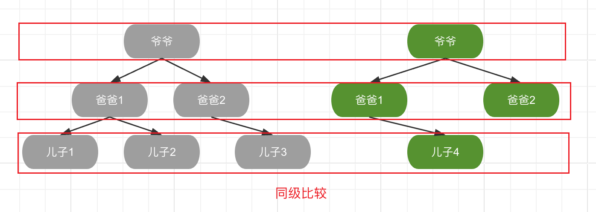
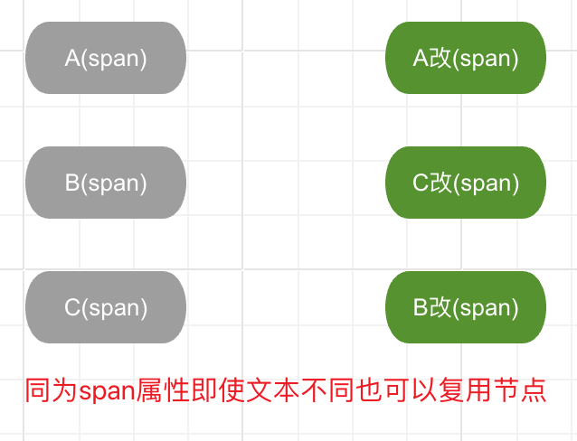
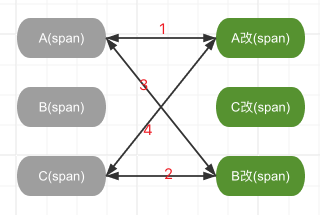

# Vue2源码揭秘 - 虚拟DOM和diff算法

##  一、什么是diff算法

    Diff算法是一种在编程中，尤其是在前端开发领域用于比较两个数据结构（常见的是DOM树或虚拟DOM树）差异的高效算法。其目的是高效地识别出从一个状态到另一个状态所需的最小变更集。因为在浏览器中操作DOM性能消耗比较昂贵，比如节点的添加、删除、移动等，所以diff算法可以尽可能的减少DOM的操作量，进而减少浏览器的性能负担。 

    如下：如果需要将下图中左边的DOM更新到右边的DOM,如果不采用虚拟DOM的方法，即无法复用DOM节点，可能需要进行6次DOM操作，第一次将旧树的A节点移除，第二次将旧树的B节点移除，第三次将旧树的C节点移除，第四次将新树A节点挂载，第五次将新树的C节点挂载，第六次将新树的B节点挂载。但是如果采用diff算法复用DOM节点的策略进行的话，实际上只需要移动一次C节点即可。


    具体到虚拟DOM的场景，Diff算法的工作原理大致如下：

### 1. 同层比较

    算法会在两个虚拟DOM树的同一层级上进行对比，而不会跨层级对比。这意味着它首先检查每个父节点下的子节点是否相同，然后递归进入子树进行比较。



如上只会同层级进行比较，如爷爷跟爷爷比较，爸爸和爸爸比较，不会存在爷爷跟爸爸、爸爸和儿子进行比较。

### 2.节点匹配

    算法会尝试根据节点的类型、属性（如Vue中的id等）和关键属性（如Vue中的key）来匹配新旧节点，以便确定哪些节点可以复用，哪些需要被添加、更新或者移除。



    在Vue中，左边节点为旧节点，右边节点为新节点，如果同为span文本节点，可以对节点进行复用，只需要更新文本中的文字即可。

    留个疑问点，那么假设span上面存在key，他还能复用节点吗？

### 3.循环从两边向中间比较

    这是一种优化策略，算法不是线性遍历每一个节点，而是从两端开始，向中间逐步靠拢，这样可以在某些情况下更早地发现差异并终止不必要的比较。



### 4.生成patch对象

    比较过程中，算法会记录差异（或成为“patch”）,这些patch描述了如何将旧的DOM树转换为新的DOM树。包括需要添加、更新或删除哪些元素及其属性。

```js
if (sameVnode(oldStartVnode, newEndVnode)) {
        // Vnode moved right
        patchVnode(oldStartVnode, newEndVnode, insertedVnodeQueue);
        api.insertBefore(
          parentElm,
          oldStartVnode.elm!,
          api.nextSibling(oldEndVnode.elm!)
        );
        oldStartVnode = oldCh[++oldStartIdx];
        newEndVnode = newCh[--newEndIdx];
}
```

    实际上，Vue diff算法并不直接生成一个明确的差异记录列表，而是在递归比较和直接操作虚拟DOM